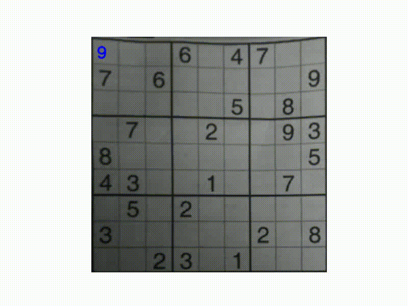
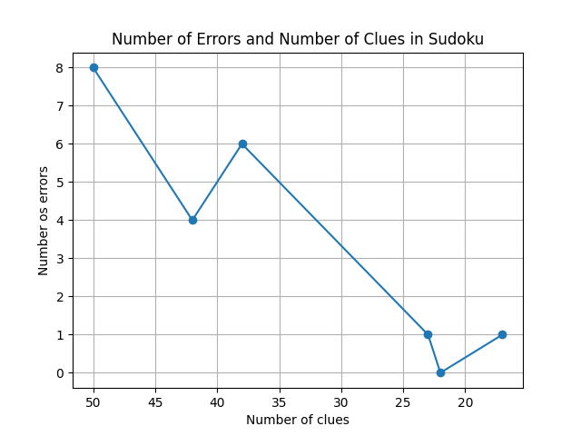

# SUDOKU SOLVER WITH COMPUTER VISION

A Sudoku solver that uses **computer vision** and **deep learning** to recognize a Sudoku board from an image, solve it, and project the solution back onto the original image.

## Demo

### Streamlit application

[▶ Watch the application demo](docs/streamlit_app.mp4)

### Backtracking search

[](docs/search.mp4)

## Pipeline

The application follows four main steps:

1. Detect and rectify the Sudoku grid using OpenCV;
2. Split the grid into individual cells;
3. Recognize the digits using a trained neural network;
4. Solve the Sudoku with backtracking and display the solution.

The recognized grid can also be manually corrected before running the solver.

## Dataset

The digit recognition model was trained using the [digits dataset](https://www.kaggle.com/datasets/karnikakapoor/digits) available on Kaggle. The dataset contains JPEG images organized by digit class from **0 to 9**. The training data can be downloaded automatically using the script provided in [`scripts/load_data.py`](scripts/load_data.py). From the project root, run:

```bash
python -m scripts.load_data
```

The script downloads the dataset and places the digit classes in the `digits/` directory:

```text
digits/
├── 0/
├── 1/
├── 2/
├── 3/
├── 4/
├── 5/
├── 6/
├── 7/
├── 8/
└── 9/
```

## OCR limitations

Digit recognition is performed by a convolutional neural network trained on **10,160 images from 10 digit classes**. The images are converted to grayscale, resized to **32 × 32 pixels**, thresholded, and normalized. The training pipeline uses rotation, zoom, and translation for data augmentation, followed by convolutional, pooling, dropout, and dense layers. The model was trained for **35 epochs** using Adam and categorical cross-entropy, achieving approximately **99.6% accuracy on the test set**. The complete training experiment is available in [`experiments/digit_recognition.ipynb`](experiments/digit_recognition.ipynb).

Despite the high accuracy on the digit test set, OCR performance on complete Sudoku images is affected by grid extraction, perspective, lighting, digit shape, and cell segmentation. The figure below shows that the **absolute number of recognition errors tends to be higher for grids containing more clues**: the evaluated examples range from 8 errors with 50 clues to only 0–1 errors for grids with 17–23 clues, with some variation between samples. Since the figure reports the total number of errors rather than the error rate per recognized digit, it mainly indicates that recognizing more filled cells creates more opportunities for OCR errors rather than demonstrating that sparse Sudokus are intrinsically easier to recognize.



## Installation

Clone the repository:

```bash
git clone https://github.com/filipemedeiross/cv_solving_sudoku.git
cd cv_solving_sudoku
```

Create and activate a virtual environment:

```bash
python -m venv .venv
source .venv/bin/activate
```

Install the dependencies:

```bash
pip install -r requirements.txt
```

## Running the application

```bash
streamlit run app_sudoku.py
```

Then open the address provided by Streamlit in your browser and enable the camera to capture a Sudoku board.

## Project structure

```text
.
├── cv/                       # computer vision pipeline
├── docs/                     # images and demonstration videos
├── experiments/
├── models/                   # trained digit recognition model
├── scripts/
│   ├── __init__.py
│   └── load_data.py          # downloads and prepares the digit dataset
├── sudoku/                   # sudoku solving algorithms
├── app_sudoku.py             # streamlit application
└── requirements.txt
```

## License

This project is distributed under the [MIT License](LICENSE).